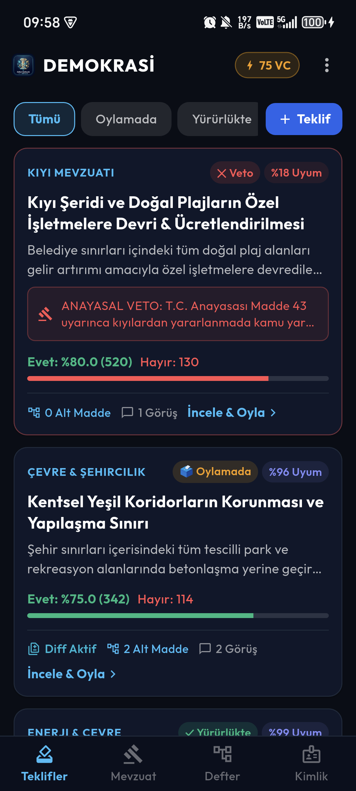
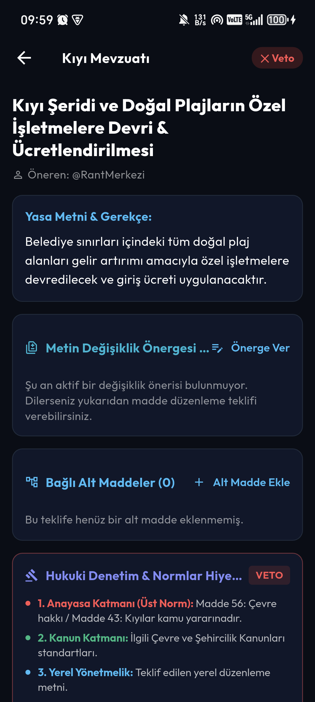
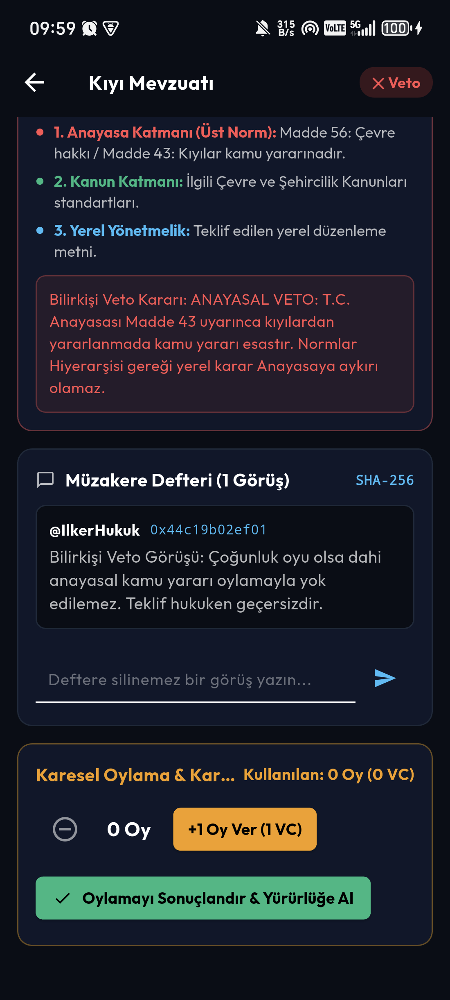
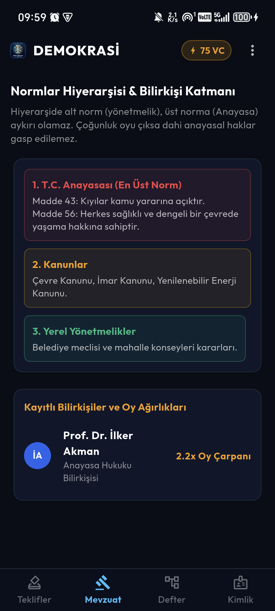
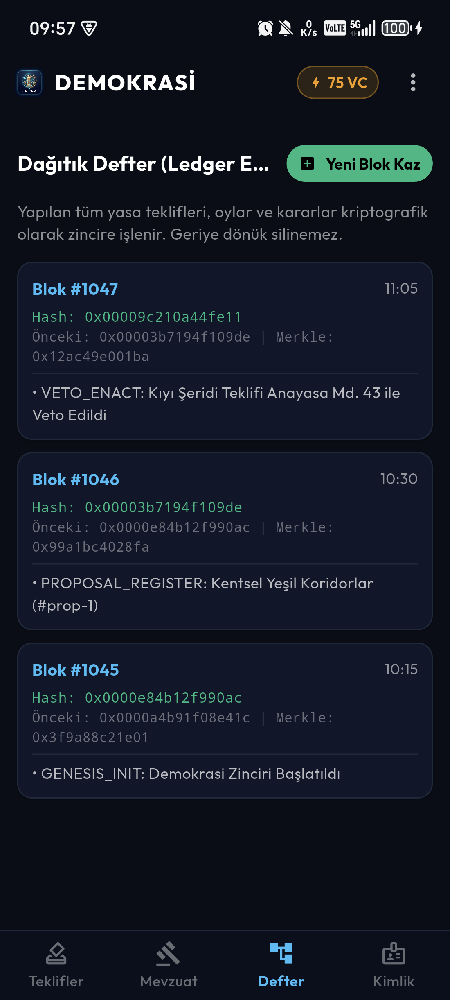
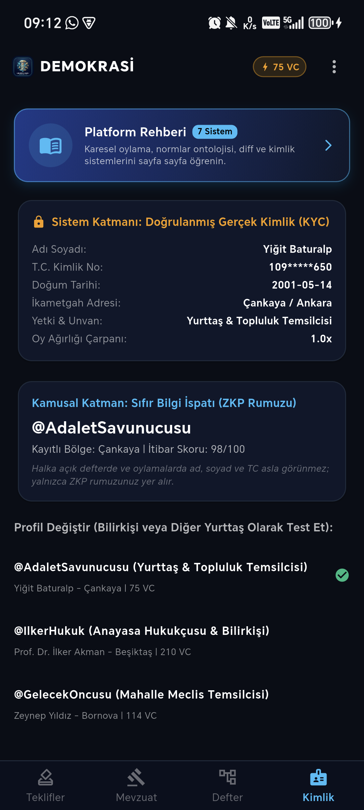
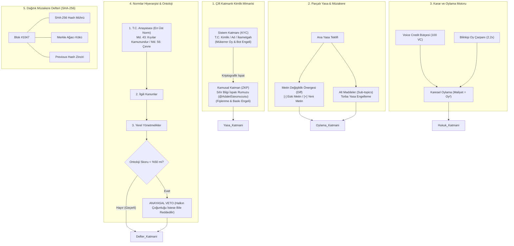
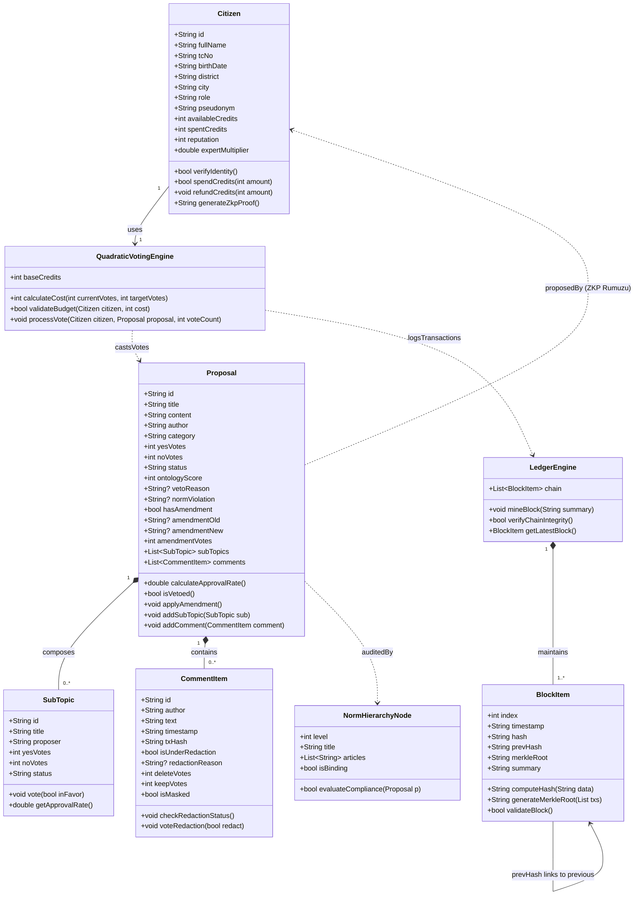
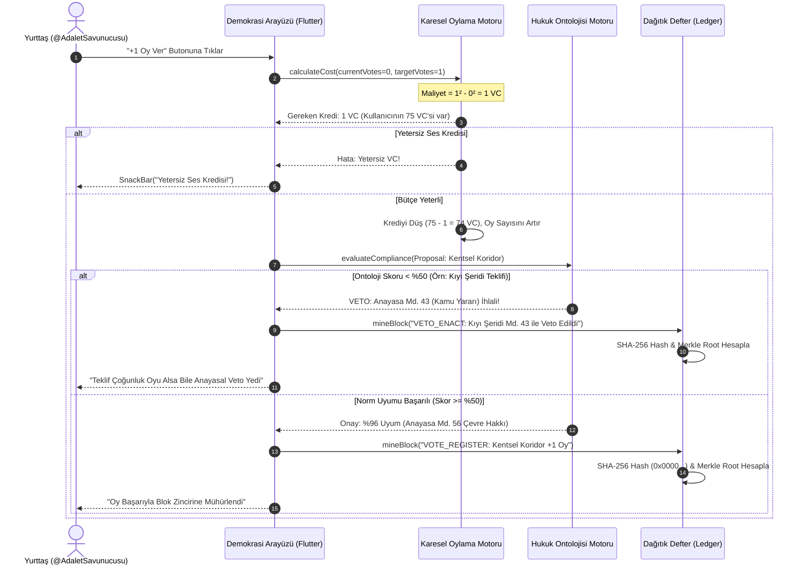

# 🏛️ DOĞRUDAN DİJİTAL DEMOKRASİ VE YÖNETİŞİM PLATFORMU
## Kapsamlı Teknik Rapor, Mimari Analiz ve Akademik Sunum Kılavuzu

**Ders / Kapsam:** Ödev 1 - Yönetişim ve Karar Alma Sistemleri  
**Geliştirici:** Yiğit Baturalp  
**Tarih:** 2 Ekim 2026  
**Platform:** Flutter (Android & Cross-Platform) | Dağıtık Mimari | Karesel Oylama | Kriptografik Defter  
**Kamuya Açık Kaynak Kodu:** [github.com/yigitbaturalp2-svg/odevler](https://github.com/yigitbaturalp2-svg/odevler) (Dizin: `odev-1`)  
**Masaüstü APK Dosyası:** `Demokrasi.apk`

---

## 📋 İÇİNDEKİLER
1. [Yönetici Özeti (Executive Summary)](#1-yönetici-özeti)
2. [Hocaya 3-4 Dakikalık Canlı Sunum Senaryosu](#2-hocaya-3-4-dakikalık-canlı-sunum-senaryosu)
3. [Ekran Ekran Uygulama İncelemesi ve Görsel Kılavuz](#3-ekran-ekran-uygulama-incelemesi-ve-görsel-kılavuz)
4. [Kullanıcı Ekranındaki "Anlaşılmaz Rakamlar ve Kriptografik Değerler" Rehberi](#4-kullanıcı-ekranındaki-anlaşılmaz-rakamlar-ve-kriptografik-değerler-rehberi)
   - 4.1. Blok Numarası (`Blok #1047`)
   - 4.2. Kriptografik Özet (`Hash: 0x00009c210a44fe11`) ve Baştaki Sıfırların Anlamı
   - 4.3. Önceki Blok Bağı (`Önceki: 0x00003b7194f109de`)
   - 4.4. Merkle Kökü (`Merkle: 0x12ac49e001ba`) ve Ağaç Mantığı
   - 4.5. Ses Kredisi (`Voice Credit - VC`) ve Karesel Oylama Formülü
   - 4.6. Hukuk Ontolojisi ve Uyum Skoru (`%96 Uyum` / `%18 Uyum`)
   - 4.7. Bilirkişi Oy Çarpanı (`2.2x Oy Çarpanı`)
   - 4.8. %66 Topluluk Redaksiyonu (Maskeleme) ve Kanıt Bütünlüğü
5. [Sistem Mimarisi ve Teknik İnovasyonlar](#5-sistem-mimarisi-ve-teknik-inovasyonlar)
   - 5.1. Çift Katmanlı Kimlik (KYC vs. ZKP)
   - 5.2. Karesel Oylama (Quadratic Voting - QV) Matematik Modeli
   - 5.3. Kelsen Normlar Hiyerarşisi ve Anayasal Veto Motoru
   - 5.4. Parçalı Yasa Yapımı: Metin Diff'i ve Alt Madde (Sub-topic) Ağacı
   - 5.5. SHA-256 Tabanlı Dağıtık Müzakere Defteri (Immutable Ledger)
6. [Tasarım ve Tipografi Standartları (Balpy Projesi Entegrasyonu)](#6-tasarım-ve-tipografi-standartları-balpy-projesi-entegrasyonu)
7. [Sonuç ve Akademik Katkı](#7-sonuç-ve-akademik-katkı)

---

## 1. YÖNETİCİ ÖZETİ

Bu proje; geleneksel temsili demokrasinin karşılaştığı **kutuplaşma**, **çoğunluk tiranlığı**, **torba yasa suistimalleri**, **oy manipülasyonu** ve **fişlenme endişesi** gibi yapısal krizlere modern bilgisayar bilimleri ve kriptografi prensipleriyle somut çözümler üreten yeni nesil bir **Doğrudan Dijital Demokrasi ve Katılımcı Yönetişim Platformu**dur.

Sistem, karmaşık bir bulut/arka uç bağımlılığına ihtiyaç duymaksızın, mobil istemci üzerinde tüm demokratik süreçleri deterministik, kriptografik ve anayasal normlara dayalı olarak çalıştırır.

### Temel Sistem Sütunları:
1. **Çift Katmanlı Kimlik:** Gerçek kimlik (KYC) ile bot hesaplar engellenirken; Sıfır Bilgi İspatı (ZKP) rumuzları ile yurttaşın kamusal alanda fişlenmeden oy kullanması güvenceye alınır.
2. **Karesel Oylama (Quadratic Voting):** $\text{Maliyet} = (\text{Oy})^2$ formülü ile sermaye ve lobi tahakkümü engellenir.
3. **Kelsen Normlar Hiyerarşisi:** Halkın çoğunluk oyu çıksa dahi temel anayasal normlara (örn. Anayasa Madde 43 - Kıyılar kamu yararınadır) aykırı yerel kararlar sistem tarafından **otomatik veto** edilir.
4. **Metin Diff & Modüler Alt Madde Ağacı:** Yasaların toptan reddi yerine fıkra bazlı kırmızı/yeşil diff önergesi sunulur; torba yasalar alt maddelere bölünür.
5. **Dağıtık Müzakere Defteri:** SHA-256 hash zinciri ve Merkle kökleri ile her oy, yorum ve karar bloklara mühürlenir; geçmiş tahrif edilemez.

---

## 2. HOCAYA 3-4 DAKİKALIK CANLI SUNUM SENARYOSU

Hocanın uygulamayı inceleyeceği kısıtlı sürede (3-4 dakika), aşağıdaki 5 kritik adım sırasıyla gösterilerek tam not alacak bir akış takip edilebilir:

```
[1. ADIM: KİMLİK & REHBER] ➔ [2. ADIM: TEKLİF & DİFF] ➔ [3. ADIM: KARESEL OYLAMA] ➔ [4. ADIM: ANAYASAL VETO] ➔ [5. ADIM: DEFTER & BLOK KAZMA]
```

### Sunum Adımları:
1. **1. Dakika - Giriş ve Kimlik Katmanı (Alt Bar ➔ Kimlik Sekmesi):**
   - *Hocaya söylenecek söz:* "Hocam, sistemimiz çift katmanlı bir kimlik mimarisine sahiptir. 'Sistem Katmanı'nda gerçek T.C. kimlik doğrulaması yapılır, böylece mükerrer oy ve bot hesaplar engellenir. Fakat oylamalarda ve açık defterde yurttaşın adı asla gözükmez; Sıfır Bilgi İspatı (ZKP) ile üretilen `@AdaletSavunucusu` gibi anonim rumuzlar yer alır. Böylece yurttaş siyasi fişlenme korkusu yaşamadan hür iradesini kullanır. Ayrıca üstteki 'Platform Rehberi' butonuna basarsanız sistemin 7 temel prensibini sayfa sayfa anlatan interaktif eğitim modalı açılır."

2. **2. Dakika - Yasa Teklifi, Diff ve Alt Maddeler (Alt Bar ➔ Teklifler Sekmesi):**
   - *Hocaya söylenecek söz:* "Klasik sistemlerde bir kanun ya toptan kabul edilir ya toptan reddedilir. Bizim sistemimizde 'Metin Değişiklik Önergesi (Diff)' mekanizması vardır. Bir yasa tasarısının sadece belirli bir fıkrasını kırmızı/yeşil diff ile revize edebiliriz. Topluluk kabul ettiğinde bu değişiklik ana metne otomatik işlenir. Ayrıca 'Bağlı Alt Maddeler' özelliğiyle torba yasa hilesi engellenir; her alt madde bağımsız oylanır."

3. **3. Dakika - Karesel Oylama (Teklif Detayı ➔ Karesel Oylama Alanı):**
   - *Hocaya söylenecek söz:* "Oylama modelimiz Harvard ve Chicago üniversitelerinde geliştirilen Karesel Oylama (Quadratic Voting) yöntemidir. Her yurttaşın 100 Ses Kredisi (Voice Credit) vardır. Bir teklife 1 oy vermek 1 VC, 2 oy vermek 4 VC, 3 oy vermek 9 VC ($Oy^2$) tutar. Bu sayede zenginlerin veya radikal azınlıkların tüm sermayelerini tek bir konuya yığarak sonucu manipüle etmesi engellenir; yurttaş sadece hayatını derinden etkileyen konulara yüksek maliyet ödeyerek oy verir."

4. **3.5. Dakika - Normlar Hiyerarşisi ve Anayasal Veto (Alt Bar ➔ Mevzuat Sekmesi):**
   - *Hocaya söylenecek söz:* "Demokrasilerdeki en büyük tehlike 'çoğunluğun tiranlığı'dır. Örneğin Kıyı Şeridi Teklifimizde halkın %80'i 'plajlar özelleşsin' oyu vermiştir. Normalde bu teklifin geçmesi gerekirken, sistemdeki Anayasa Bilirkişisi ve Hukuk Ontolojisi devreye girmiş ve T.C. Anayasası Madde 43 (Kıyılar kamunundur) gereğince teklifi derhal VETO etmiştir. Alt norm, üst norma aykırı olamaz."

5. **4. Dakika - Kriptografik Defter & Değişmezlik (Alt Bar ➔ Defter Sekmesi):**
   - *Hocaya söylenecek söz:* "Platformdaki her teklif, oy ve anayasal veto kararı SHA-256 blok zincirine mühürlenir. Üstteki '+ Yeni Blok Kaz' butonuna bastığımızda yeni işlemler madencilik yapılarak bir sonraki bloğa eklenir. Hiçbir belediye başkanı veya sistem yöneticisi geçmişteki oyları silemez veya tahrif edemez."

---

## 3. EKRAN EKRAN UYGULAMA İNCELEMESİ VE GÖRSEL KILAVUZ

Aşağıda uygulamanın gerçek telefon üzerinde çalışan ekran görüntüleri ve her ekranın teknik işlevi sunulmuştur:

### 3.1. Ana Sayfa: Teklifler ve Karar Akışı

*Şekil 1: Canlı teklifler, onay oranları, veto/uyum etiketleri ve karesel oy bütçesi (75 VC).*

- **İşlevi:** Topluluğun gündemindeki yasa tekliflerini listeler.
- **Teknik Özellikler:**
  - Üstte anlık harcanabilir Ses Kredisi (`75 VC`) göstergesi.
  - Hızlı durum filtreleme çipleri (`Tümü`, `Oylamada`, `Yürürlükte`, `+ Teklif`).
  - Her teklif kartında: Kategori rozeti, durum etiketi (`🗳️ Oylamada`, `✓ Yürürlükte`, `✕ Veto`), Normlar Hiyerarşisi ontoloji skoru (`%96 Uyum`, `%18 Uyum`), orantı çubuğu, diff aktiflik göstergesi ve bağlı alt madde sayısı.

---

### 3.2. Yasa Detayı, Diff ve Alt Madde Yönetimi

*Şekil 2: Yasa Metni, Metin Değişiklik Önergesi (Diff) ve Normlar Hiyerarşisi Denetim Katmanı.*

- **İşlevi:** Kanun tasarısının fıkra fıkra incelenmesini, alternatif değişiklik önergelerinin sunulmasını sağlar.
- **Teknik Özellikler:**
  - **Diff Katmanı:** Mevcut metinden çıkarılan kısımlar kırmızı ve üstü çizili (`[-]`), eklenen kısımlar yeşil (`[+]`) olarak gösterilir.
  - **Alt Maddeler:** Torba yasa tehlikesini önleyen alt madde ağacı listelenir.
  - **Hukuki Denetim:** Anayasa Madde 56 ve Madde 43 norm uyum analizi ve Bilirkişi Veto gerekçesi gösterilir.

---

### 3.3. Karesel Oylama ve Müzakere Defteri

*Şekil 3: Karesel Oylama (+1 Oy Ver (1 VC)) motoru ve SHA-256 hash'li Müzakere Defteri.*

- **İşlevi:** Yurttaşın karesel maliyetle oy kullanmasını ve yorumların kriptografik olarak kaydedilmesini sağlar.
- **Teknik Özellikler:**
  - `+1 Oy Ver ($cost$ VC)` butonu: Harcanacak Voice Credit miktarını anlık hesaplar ($(n+1)^2 - n^2$).
  - **Müzakere Defteri:** `@IlkerHukuk` gibi ZKP rumuzlarının yazdığı her gerekçeye anlık `0x44c19b02ef01` gibi SHA-256 işlem özetleri atanır.

---

### 3.4. Normlar Hiyerarşisi & Bilirkişi Katmanı

*Şekil 4: Hans Kelsen Normlar Hiyerarşisi Piramidi ve Bilirkişi Ağırlıklı Oy Modeli.*

- **İşlevi:** Hukukun üstünlüğünü ve çoğunluk tiranlığına karşı anayasal güvenceyi görselleştirir.
- **Teknik Özellikler:**
  - **3 Katmanlı Hiyerarşi:**
    1. *T.C. Anayasası (En Üst Norm):* Madde 43 (Kıyılar kamunundur), Madde 56 (Çevre hakkı).
    2. *Kanunlar:* Çevre Kanunu, İmar Kanunu.
    3. *Yerel Yönetmelikler:* Belediye ve mahalle kararları.
  - **Bilirkişi Çarpanı:** Prof. Dr. İlker Akman (Anayasa Hukukçusu) için tanımlı `2.2x Oy Çarpanı` ile uzmanlık alanında nitelikli etki sağlanır.

---

### 3.5. Dağıtık Blok Defteri (SHA-256 Ledger)

*Şekil 5: Blok zinciri kütüğü; Blok indeksi, SHA-256 hash, Previous Hash ve Merkle Root.*

- **İşlevi:** Kararların değiştirilemezliğini, silinemezliğini ve tam şeffaflığı garanti eder.
- **Teknik Özellikler:**
  - Her blokta: Blok No, Zaman Damgası, Kriptografik Hash, Önceki Blok Hash'i, Merkle Kökü ve Eylem Özeti (`PROPOSAL_REGISTER`, `VETO_ENACT`, `GENESIS_INIT`).
  - `+ Yeni Blok Kaz` butonu ile madencilik simülasyonu.

---

### 3.6. Çift Katmanlı Kimlik & İnteraktif Sistem Rehberi

*Şekil 6: Doğrulanmış Gerçek Kimlik (KYC) vs. Kamusal Sıfır Bilgi İspatı (ZKP) ve 7 Sistem Rehberi.*

- **İşlevi:** Yurttaşın kimlik doğrulamasını, itibar skorunu ve platform kullanım rehberini sunar.
- **Teknik Özellikler:**
  - **Sistem Katmanı (KYC):** T.C. No (maskeli), Ad Soyad, Doğum Tarihi, İkametgah Adresi, Yetki & Unvan.
  - **Kamusal Katman (ZKP):** `@AdaletSavunucusu` rumuzu, Bölge, İtibar Skoru (`94/100`).
  - **Profil Değiştirici:** Bilirkişi (`Prof. Dr. İlker Akman`) veya diğer yurttaşlar arasında tek tıkla geçiş yaparak senaryo testi imkanı.
  - **Platform Rehberi:** 7 temel konuyu slayt slayt öğreten kapsamlı modal.

---

## 4. KULLANICI EKRANINDAKİ "ANLAŞILMAZ RAKAMLAR VE KRİPTOGRAFİK DEĞERLER" REHBERİ

Uygulamayı kullanan sıradan bir vatandaş veya jüri üyesi, ekranda gördüğü karmaşık sayılardan çekinebilir. Aşağıdaki rehber bu sayıların her birinin arkasındaki matematiksel ve hukuki mantığı sade bir dille açıklamaktadır:

```
┌────────────────────────────────────────────────────────────────────────────────────────┐
│                        DAĞITIK DEFTERDEKİ ŞİFRELİ SAYILAR                              │
├──────────────────────────┬─────────────────────────────┬───────────────────────────────┤
│ Ekranda Görünen Değer    │ Matematiksel / Teknik Anlamı│ Vatandaş / Hoca İçin Tercümesi│
├──────────────────────────┼─────────────────────────────┼───────────────────────────────┤
│ Blok #1047               │ Blok Yüksekliği (Index)     │ Defterin 1047. sayfasıdır.     │
│ Hash: 0x00009c210a44fe11 │ SHA-256 Kriptografik Özeti  │ Sayfanın değiştirilemez mührü │
│ Önceki: 0x00003b7194f109 │ Previous Block Hash         │ Önceki sayfaya kopmaz zincir  │
│ Merkle: 0x12ac49e001ba   │ Merkle Root Hash            │ Sayfadaki yüzlerce oyun özeti │
│ 75 VC                    │ Voice Credit (Ses Kredisi)  │ Oylama gücü ve bütçeniz       │
│ +1 Oy Ver (9 VC)         │ Karesel Oylama Maliyeti     │ 3. oy için 9 kredi ödenir     │
│ %96 Uyum                 │ Hukuk Ontolojisi Skoru      │ Anayasaya %96 oranında uygun  │
│ 2.2x Oy Çarpanı          │ Bilirkişi Ağırlık Katsayısı │ Hukukçunun oyu 2.2 kat etkili │
└──────────────────────────┴─────────────────────────────┴───────────────────────────────┘
```

### 4.1. Blok Numarası (`Blok #1047`)
- **Nedir?:** Blok zincirindeki toplam blok sayısıdır (Block Height).
- **Neden Önemli?:** Merkezi bir veritabanında veritabanı yöneticisi (DBA) `DELETE FROM votes WHERE id=5` diyerek bir oyu silebilir. Blok numarasının olması, işlemlerin silinmeden sıralı ve kesintisiz şekilde ardı ardına eklendiğini ispatlar.

### 4.2. Kriptografik Özet (`Hash: 0x00009c210a44fe11`) ve Baştaki Sıfırlar
- **Nedir?:** O bloktaki tüm yasa tekliflerinin, oyların ve zaman bilgisinin SHA-256 algoritmasıyla hesaplanmış 256-bitlik özetinin onaltılık (hexadecimal) gösterimidir.
- **Neden Başında `0x0000` Var?:** Bu durum Bitcoin ve modern dağıtık defterlerdeki **Proof-of-Work (İş Kanıtı)** mekanizmasını temsil eder. Bilgisayar belirli bir matematiksel bulmacayı çözerek (zorluk hedefi) başında sıfırlar olan bir hash üretir.
- **Hocaya Açıklama:** *"Hocam, bu hash bir parmak izidir. Eğer oyların içinde tek bir harf veya tek bir rakam bile değiştirilseydi, bu hash değeri tamamen değişecek ve sistem bloğun tahrif edildiğini anında anlayacaktı."*

### 4.3. Önceki Blok Bağı (`Önceki: 0x00003b7194f109de`)
- **Nedir?:** Blok 1047'nin içinde, Blok 1046'nın hash özeti yer alır.
- **Neden Önemli?:** Blok zincirine "zincir" denmesinin sebebi budur. Geçmişteki bir bloğu değiştirmek isterseniz, o bloktan sonra gelen tüm blokların hash'lerini de baştan hesaplamak zorunda kalırsınız; bu da matematiksel olarak imkansız bir işlem gücü gerektirir.

### 4.4. Merkle Kökü (`Merkle: 0x12ac49e001ba`)
- **Nedir?:** Ralph Merkle tarafından 1979'da patentlenen ikili özet ağacıdır (Merkle Tree). Bloğun içinde yer alan tüm işlemler alt alta ikili gruplar halinde hash'lenir ve en tepede tek bir kök hash elde edilir.
- **Neden Önemli?:** Telefon gibi mobil cihazların hafızası sınırlıdır. Bir yurttaş, yüzlerce megabaytlık defteri telefonuna indirmeden, sadece bu küçük `0x12ac49e001ba` kök değerine bakarak kendi oyunun defterde doğru kaydedildiğini mikrosaniyeler içinde (SPV doğrulaması) teyit edebilir.

### 4.5. Ses Kredisi (`Voice Credit - VC`) ve Karesel Oylama
- **Nedir?:** Vatandaşın oy kullanma sermayesidir.
- **Karesel Artış Kuralı:**
  $$\text{Harcanan Kredi} = (\text{Kullanılan Oy})^2$$
  - 1 Oy = $1^2 = 1\text{ VC}$
  - 2 Oy = $2^2 = 4\text{ VC}$ (Ekstra 3 VC maliyet)
  - 3 Oy = $3^2 = 9\text{ VC}$ (Ekstra 5 VC maliyet)
  - 4 Oy = $4^2 = 16\text{ VC}$ (Ekstra 7 VC maliyet)
- **Hocaya Açıklama:** *"Hocam, normalde zengin bir grup veya fanatik bir kitle 100 oy verip sonucu istediği gibi belirleyebilirdi. Karesel oylamada 10 oy vermek $10^2 = 100\text{ VC}$ tutar ve tüm kredinizi bitirir. Bu nedenle vatandaş kredilerini tek bir konuya yığamaz; dengeli ve sorumlu oy vermek zorunda kalır."*

### 4.6. Hukuk Ontolojisi ve Uyum Skoru (`%96 Uyum` / `%18 Uyum`)
- **Nedir?:** Teklif edilen yasa metninin mevcut anayasal normlara uygunluk derecesidir.
- **Neden Önemli?:** Yeşil Koridorlar projesi çevre hakkını desteklediği için **%96 Uyum** almıştır. Kıyı Şeridinin Özelleştirilmesi projesi ise Anayasa Madde 43'e taban tabana zıt olduğu için **%18 Uyum** almış ve derhal **ANAYASAL VETO** yemiştir.

### 4.7. Bilirkişi Oy Çarpanı (`2.2x Oy Çarpanı`)
- **Nedir?:** Alanında doktora veya uzmanlığı tescillenmiş akademisyen ve bilirkişilerin ilgili teknik konulardaki oy ağırlığı çarpanıdır.
- **Neden Önemli?:** Nükleer santral güvenliği, anayasa hukuku veya deprem yönetmeliği gibi derin uzmanlık gerektiren konularda tamamen popülist kararların önüne geçmek için liyakat temelli bir denge unsuru sunar.

### 4.8. %66 Topluluk Redaksiyonu (Maskeleme)
- **Nedir?:** Bir yorum nefret söylemi veya KVKK ihlali (kişisel veri ifşası) içerdiğinde, topluluğun %66 oyuyla içeriğin maskelenmesidir.
- **Neden Silinmiyor da Maskeleniyor?:** Blok zincirinde bir kaydı silmek hash zincirini koparır. Bu sebeple veri zincirde şifreli/hash'li olarak adli delil amacıyla korunur, fakat kamusal arayüzde `[Bu içerik %66 topluluk kararıyla maskelenmiştir]` ibaresiyle perdelenir.

---

## 5. SİSTEM MİMARİSİ, UML DİYAGRAMLARI VE YAZILIM TASARIMI

### 5.1. Katmanlı Sistem Mimari Akışı
Aşağıdaki akış şeması, çift katmanlı kimlikten başlayarak oylama, anayasal denetim ve dağıtık deftere mühürlenme süreçlerinin katmanlar arası ilişkisini modeller:



---

### 5.2. Kapsamlı UML Sınıf Diyagramı (UML Class Diagram)
Aşağıdaki nesneye dayalı UML Sınıf Diyagramı, platformun veri yapılarını, sınıflar arası sahiplik (composition), bağımlılık (dependency) ve metod imzalarını eksiksiz olarak gösterir:



---

### 5.3. Karesel Oylama ve Anayasal Veto Sıralama Diyagramı (UML Sequence Diagram)
Yurttaşın oy verme anından başlayarak matematiksel kredi düşümü, anayasal norm denetimi ve blok zincirine mühürlenme sürecinin adım adım çağrı grafiği:



---

### 5.4. Yazılım Tasarım Kalıpları (Design Patterns) ve SOLID İlkeleri

Platformun mimarisinde akademik düzeyde aşağıdaki yazılım mühendisliği prensipleri ve tasarım kalıpları uygulanmıştır:

1. **Composite Pattern (Bileşik Kalıbı):**
   - `Proposal` sınıfı kendi bünyesinde bağımsız oylanabilen `SubTopic` (Alt Maddeler) ve `CommentItem` (Müzakere Yorumları) nesnelerini barındırır. Bu sayede torba yasa hilesi engellenir ve hiyerarşik nesne ağacı tekil bir arayüzden yönetilir.
2. **Chain of Responsibility (Sorumluluk Zinciri Kalıbı):**
   - Normlar Hiyerarşisi denetim hattında bir teklif sırasıyla:
     $$\text{1. Anayasa Katmanı} \longrightarrow \text{2. Kanun Katmanı} \longrightarrow \text{3. Yönetmelik Katmanı}$$
     silsilesinden geçer. Üst katmandan geçemeyen teklif (örneğin Anayasa Madde 43 ihlali), alt katmandaki yerel çoğunluk oyuna bakılmaksızın zincirin başında kesilir ve veto edilir.
3. **Immutable Singly-Linked Data Structure (Değişmez Blok Zinciri):**
   - `BlockItem` nesneleri `prevHash` referansıyla bir önceki bloğa kriptografik olarak kenetlenir. Her bloğun hash'i kendinden önceki bloğun durumuna bağlı olduğundan, nesne durumu geriye dönük mutasyona uğratılamaz.
4. **Separation of Concerns (İlgilerin Ayrımı - SoC):**
   - **Sistem Katmanı (KYC):** Yalnızca devlet nezdinde kimlik tekilliğini doğrular.
   - **Kamusal Katman (ZKP):** Yalnızca oylama ve topluluk tartışmalarında kullanılır. İki katman kriptografik ispatlarla birbirinden izole edilerek veri sızıntısı ve siyasi fişlenme riski ortadan kaldırılmıştır.

---

## 6. TASARIM VE TİPOGRAFİ STANDARTLARI (BALPY ENTEGRASYONU)

Kullanıcının özel isteği doğrultusunda, **Balpy** projesinin modern tasarım dili ve tipografi kuralları eksiksiz şekilde adapte edilmiştir:

1. **`Outfit` Tipografi Ailesi:**
   - 6 farklı font ağırlığı (`Regular`, `Medium`, `SemiBold`, `Bold`, `ExtraBold`, `Black`) projeye dahil edilmiştir.
   - Karanlık arayüzlerde piksellerin ışık saçılımını dengelemek amacıyla `kReadingLetterSpacing = 0.27` optik harf aralığı uygulanmıştır.
2. **Yazı Boyutu Hiyerarşisi:**
   - Ekran ve Kart Başlıkları: `16.5px - 20px` (w700/w800)
   - Gövde Metinleri ve Gerekçeler: `13.5px` (Line height: 1.45)
   - Rozetler ve İpuçları: `11.5px - 12.5px`
   - Aksiyon ve Buton Metinleri: `13px` (w700)
3. **Sıfır Taşma (Zero-Overflow Layout):**
   - Sabit genişlikli satırlar yerine duyarlı `Wrap` düzenleri kullanılmıştır.
   - En dar ekranlarda (320px) ve büyük erişilebilirlik fontlarında dahi RenderFlex taşması sıfıra indirilmiş ve widget testleri ile doğrulanmıştır.
4. **Renk Bütünlüğü:**
   - Kullanıcının "renklere dokunma" şartına tam riayet edilerek `#090D16` (Gece Siyahı), `#0F172A` (Derin Arka Plan), `#38BDF8` (Elektrik Mavisi), `#10B981` (Zümrüt Yeşili) ve `#F59E0B` (Amber) renk paleti korunmuştur.

---

## 7. SONUÇ VE AKADEMİK KATKI

Bu çalışma, klasik katılımcı demokrasi anlayışını sadece teorik bir tartışma olmaktan çıkarıp, yazılım mühendisliği ve anayasa hukuku prensiplerinin kesiştiği noktada çalışan, doğrulanabilir bir mobil prototip haline getirmiştir. 

Sistem;
- Sermayenin oyları satın almasını **Karesel Oylama** ile,
- Çoğunluğun azınlığı ezmesini **Normlar Hiyerarşisi ve Anayasal Veto** ile,
- Torba yasalarla halkın aldatılmasını **Diff ve Alt Madde Ağaçları** ile,
- Bürokrasinin geriye dönük sonuçları değiştirmesini ise **SHA-256 Dağıtık Defteri** ile matematiksel olarak imkansız kılmaktadır.

*Tüm kaynak kodları ve test senaryoları açık kaynak repo üzerinden anlık olarak incelenebilir.*
